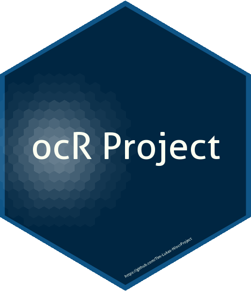

<!-- README.md is generated from README.Rmd. Please edit that file -->

# ocrProject 

<!-- badges: start -->

[](https://www.tidyverse.org/lifecycle/#stable)
[](https://github.com/Tim-Lukas-H/ocrProject/actions)
[](/commits/master)
[](https://github.com/Tim-Lukas-H/ocrProject)
<!-- badges: end -->

The goal of ocrProject is to create workable datasets from the
individual Truhart scans.

## Installation

Install from [GitHub](https://github.com/) with:

``` r
devtools::install_github("Tim-Lukas-H/ocrProject")
```

## Order of R-Files

1.  data\_import.R
2.  gen\_deathyear.R
3.  gen\_reign\_summary.R
4.  gen\_header.R
5.  gen\_group\_id.R
